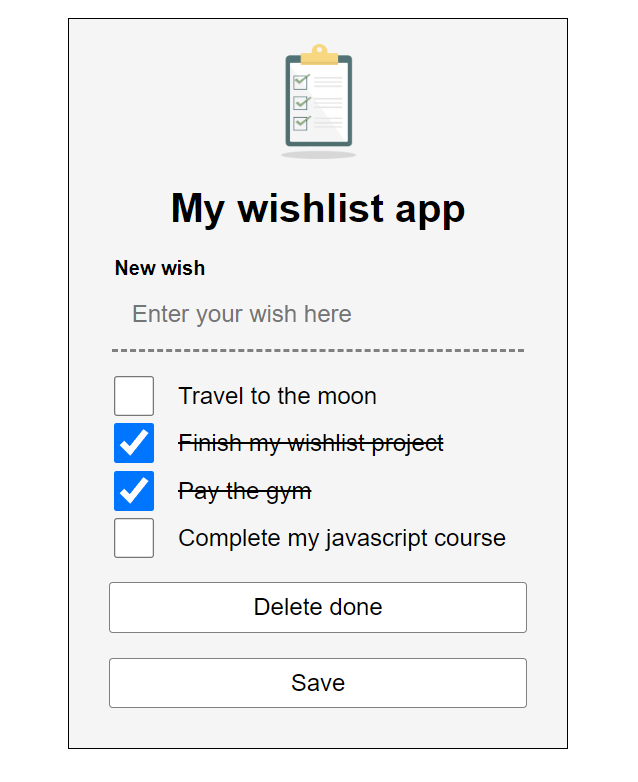

# Proyecto WhisList para DAW en Entorno de Cliente

_Este proyecto consiste en la creación de una lista de deseos en React capaz de ofrecer ciertas funcionalidades con los conocimientos adquiridos en la asignatura a lo largo del trimestre._

_A continuación se citan los requisitos necesarios para sacar la máxima puntucación:_

* Incluir alguna imagen en la cabecera a modo de logo de la aplicación.
* Mostrar una lista de deseos con un checkbox que permita marcar el deseo como completado. Una vez marcado el deseo debe mostrarse diferente al resto, por ejemplo tachando el texto.
* Permitir añadir deseos nuevos simplemente pulsando la tecla intro en el campo de texto.
* Añadir un botón que también sirva para añadir el texto del nuevo deseo a la lista.
* Almacenar deseos en el almacenamiento local del navegador y recuperarlos automáticamente al abrir la aplicación.
* Eliminar un deseo concreto de la lista.
* Editar un deseo concreto de la lista, mediante la edición en línea del texto, mediante un modal, etc.
* Reordenar los deseos de la lista, arrastrando los deseos, mediante iconos para subir o bajar el deseo, etc.
* Buscar deseos, la lista se filtrará mostrando sólo los que correspondan con la búsqueda. Incluir algún proceso para eliminar esa búsqueda y que vuelvan a aparecer todos los deseos.

### Instalación 🔧

Para instalar este proyecto tan solo sería necesario inntroducir ciertos comandos que se mostrarán a continuación

- Con este comando añadiríamos todas las librerías necesarias y que tenemos en nuestro paquete json.

```
npm install
```
- Una vez instalado veremos una nueva carpeta llamada node_modules donde tendremos guardados todas las librerías necesarias para que nuestro programa funcione.


## Comenzando 🚀

_Para iniciar nuestro proyecto simplemente debemos introducir el siguiente comando_

```
npm run start
```

Así se vería una vez iniciado

 <br>



 <br>

## Funcionalidades del proyecto:

<br>

1. Espacio para introducir nuevos deseos pulsando enter.
2. Checkbox donde podremos marcar los deseos realizados.
3. Boton para borrar los deseos ya realizados.
4. Botón para guardar en el local host los cambios realizados
5. Podremos mover los deseos de sitio simplemente clicando en ellos y arrastrando.


## Autor ✒️

* **José Luis Caravaca Carretero** - *Proyecto WishList React* - [I.E.S Francisco de los rios](https://github.com/Chelu97)

## Licencia 📄

Este proyecto está bajo la Licencia (MIT License) - mira el archivo [LICENSE.md] para detalles

